<h1 align="center">CoronaryTwin</h1>

<p align="center">
  <b>A living 3D coronary "twin" that shows <i>where</i> risk sits, <i>how sure</i> the model is, <i>why</i> it thinks so, and <i>what would change it</i>.</b><br>
  Multimodal AI Hackathon 2026 · Track A: Cardiovascular Risk Visualization &amp; Prediction
</p>

<p align="center">
  
  
  
  
  
  
</p>

<p align="center">
  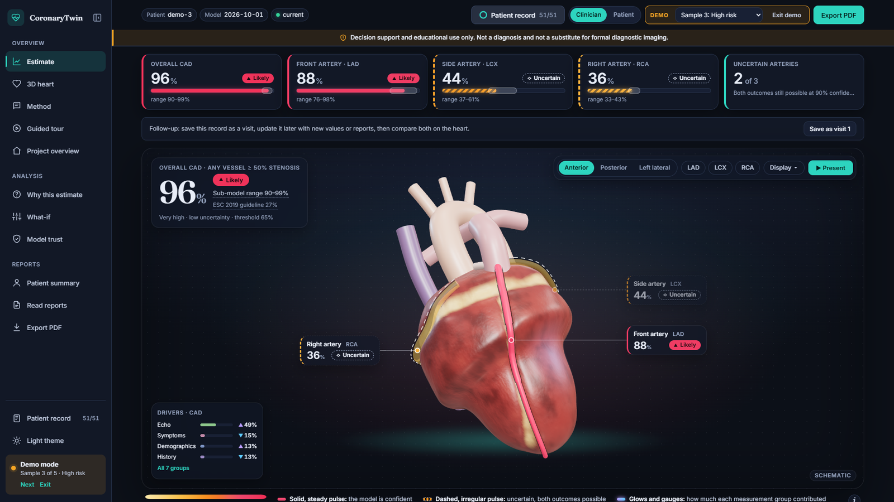
</p>

> ⚠️ **For decision support and educational purposes only. Not a substitute for formal
> diagnostic imaging or clinical judgment.**

CoronaryTwin predicts overall coronary artery disease (CAD) and stenosis in the LAD, LCX and RCA from 51 routine clinical
measurements, then shows each artery as its own 3D object, colored by its calibrated probability, with uncertainty, SHAP
explanations and what-if sensitivity analysis. Try it in one click with **▶ Try demo** (five sample patients), or drop in
lab, ECG and echo reports and let it read the values for you.

## Results at a glance

Every number comes from patients the model never saw (nested 5×5 cross-validation, 303 patients). Details: [model card](docs/MODEL_CARD.md), [experiments](docs/experiments.md).

| Estimate | Model | ROC-AUC (95% CI) |
|---|---|---|
| Overall CAD | Logistic regression | **0.92** (0.91–0.93) |
| LAD (front artery) | Random forest | **0.85** (0.83–0.87) |
| LCX (side artery) | Random forest | 0.72 (0.70–0.75) |
| RCA (right artery) | Logistic regression | 0.72 (0.69–0.74) |

- **Better than what doctors use today:** on overall CAD it ranks patients better than the ESC 2019 guideline pre-test score
  by **+0.10 AUC** (95% CI +0.06 to +0.15), and better than the CAD Consortium score with risk factors by +0.05.
- **Honest uncertainty:** conformal prediction at 90% coverage (measured 90.5%). When both outcomes remain possible, the
  artery is shown as **Uncertain** instead of guessing.
- **Says where it is weak:** for LCX and RCA it is not reliably better than simple clinical scores, and the app states this.

## What it looks like

<table>
  <tr>
    <td width="50%">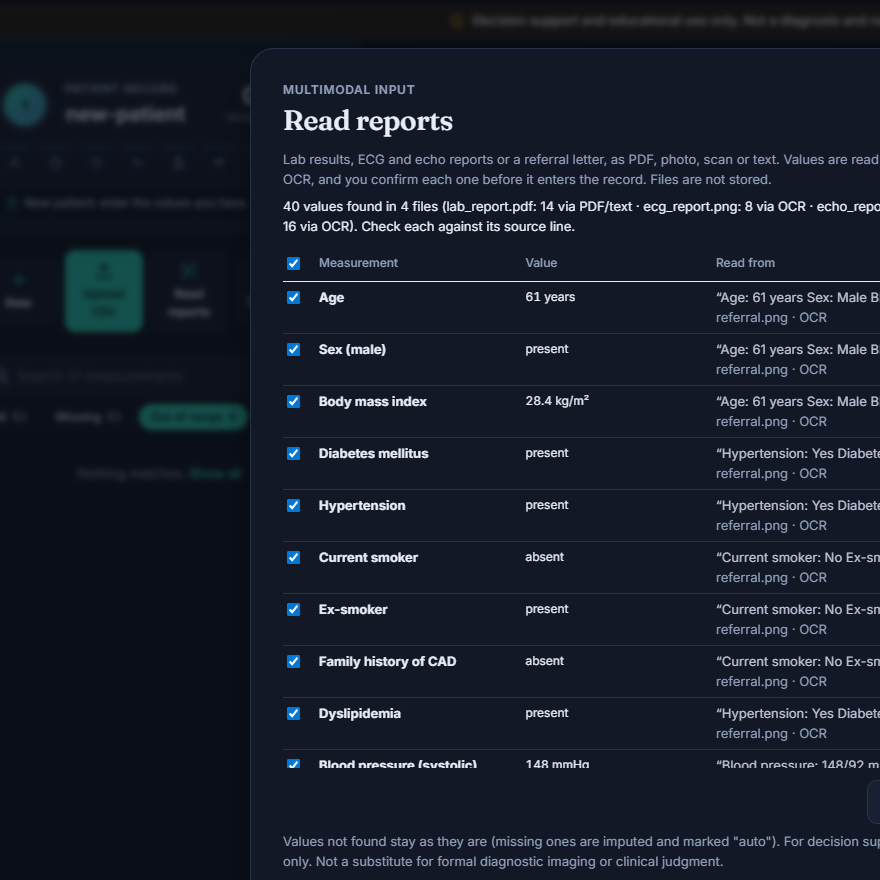<br><b>Read reports.</b> Drop in a lab PDF or photos of ECG, echo and referral reports. On-device OCR proposes the values, converts units and shows the line each came from; nothing enters the record until you confirm it.</td>
    <td width="50%">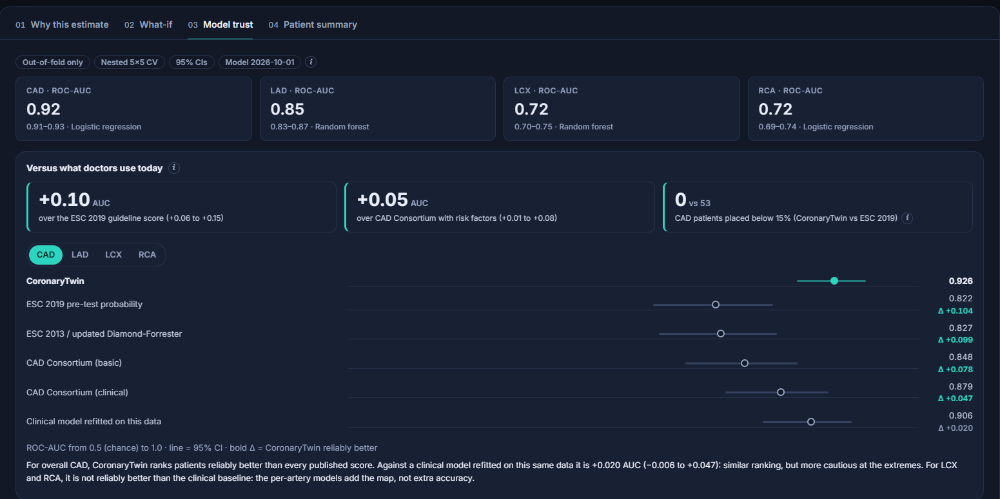<br><b>Versus guideline scores.</b> The Model trust tab compares the model with the ESC 2019, ESC 2013 and CAD Consortium pre-test scores on the same patients, with confidence intervals.</td>
  </tr>
  <tr>
    <td>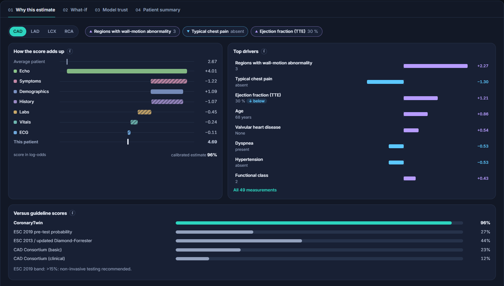<br><b>Why this estimate.</b> A waterfall from the average patient to this one, in the model's own units, plus the strongest measurements and similar past patients.</td>
    <td>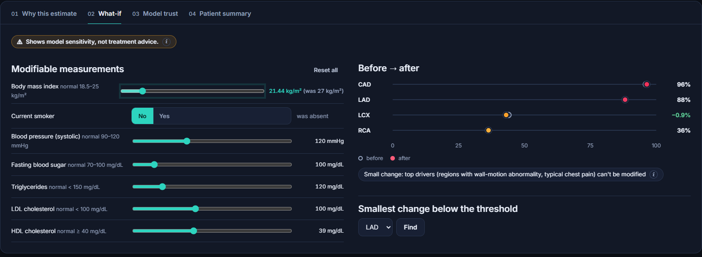<br><b>What-if.</b> Sliders for the values a patient can change; the arteries recolor live. Model sensitivity, not medical advice.</td>
  </tr>
  <tr>
    <td>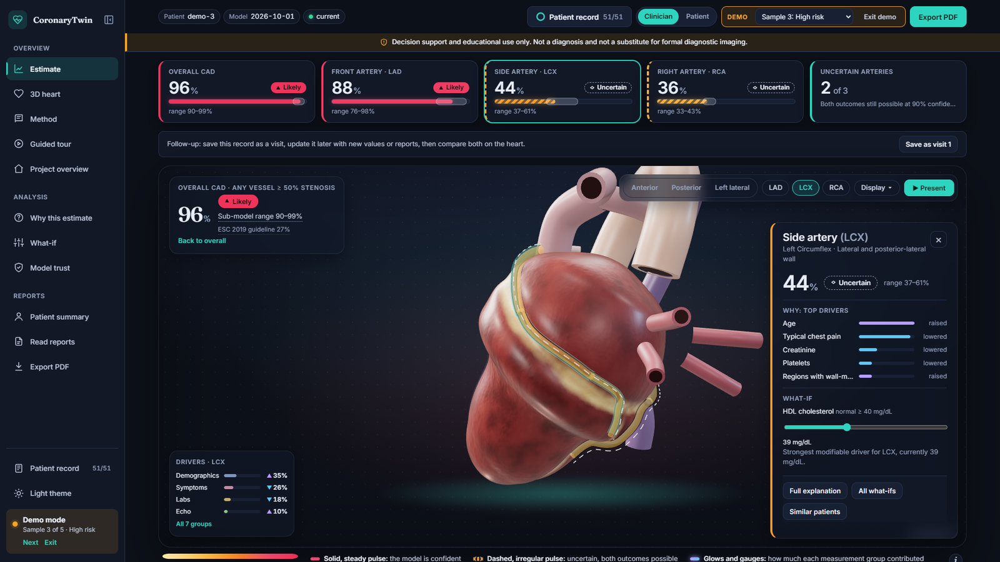<br><b>One artery at a time.</b> Each artery has its own model, drivers, sub-model range and what-if slider.</td>
    <td>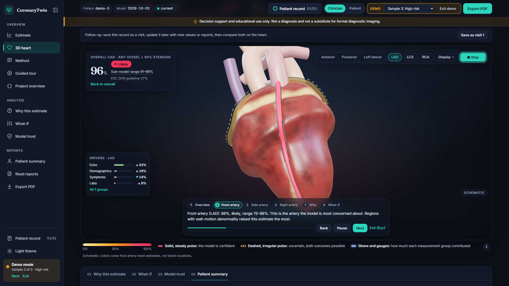<br><b>Present mode.</b> A guided walkthrough with captions generated from the patient's numbers, for ward rounds or judges.</td>
  </tr>
  <tr>
    <td>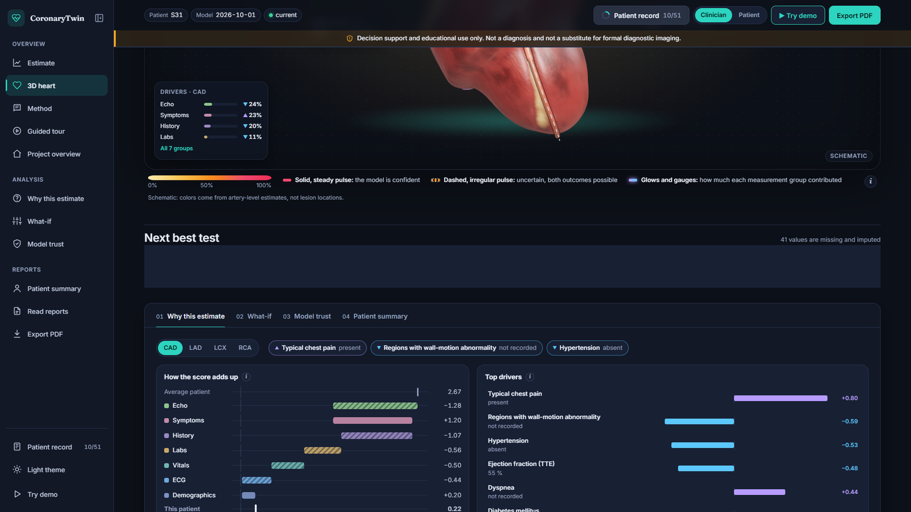<br><b>Next best test.</b> With missing values, it ranks which test would move the estimates most. Out-of-range or unusual inputs get a warning.</td>
    <td>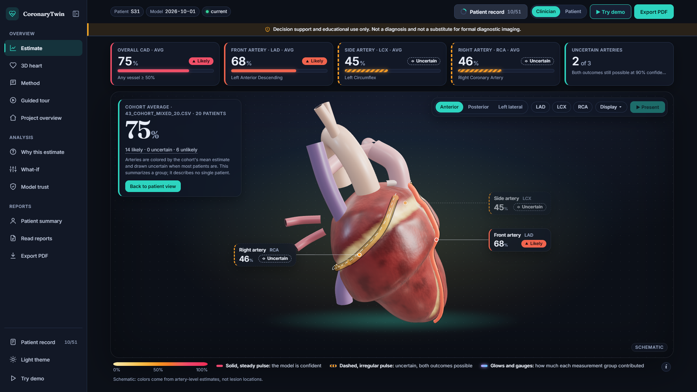<br><b>Cohorts.</b> Upload a CSV of many patients: each is scored, and the heart can show the cohort averages.</td>
  </tr>
</table>

**Compare visits.** Save a visit, update the record (new values or newer reports), then scrub or play between the two; the heart, callouts and KPI tiles follow.

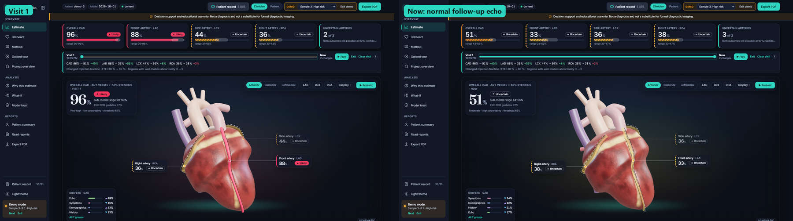

<table>
  <tr>
    <td width="50%">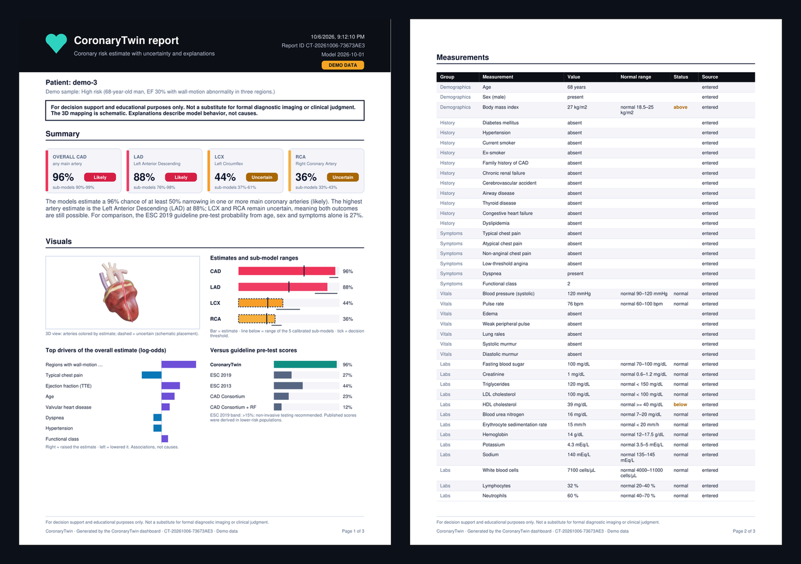<br><b>Export PDF.</b> A generated A4 report: estimates, charts, guideline comparison, every measurement with its source, and findings.</td>
    <td width="50%">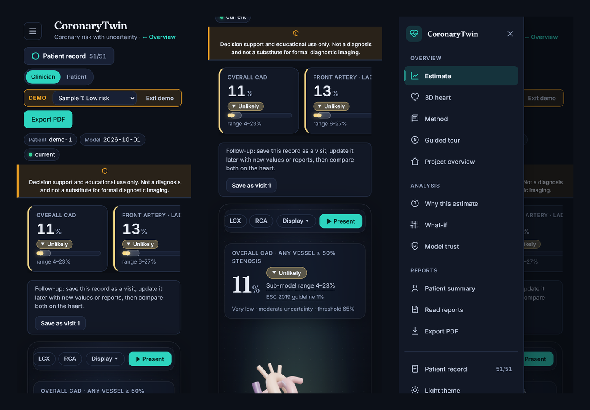<br><b>Works on phones.</b> The sidebar becomes a drawer and the layout reflows; light and dark themes.</td>
  </tr>
</table>

## Quick start

**Docker (one command):**

```bash
docker compose up --build        # app: http://localhost:8080 · API docs: http://localhost:8000/docs
```

**Locally** (Python 3.13, Node 24):

```bash
python tasks.py setup     # virtual environment with pinned dependencies
python tasks.py serve     # API on http://127.0.0.1:8000
python tasks.py web       # app on http://localhost:5173
```

Then click **▶ Try demo**, upload a patient CSV (50 samples in [csv/](csv/)), or **Read reports** with the sample reports
in [samples/reports/](samples/reports/). The trained models are committed, so no training is needed.
Open `/?tour=1#dashboard` for a guided tour.

**Deploy:** API on Hugging Face Spaces + website on Vercel, both free. Step by step: [docs/DEPLOY.md](docs/DEPLOY.md).

## How it works

```
  Form · CSV · reports (PDF/photo)  ─▶  React + React Three Fiber  ──/api──▶  FastAPI
                                        3D heart + dashboard                   4 calibrated models (CAD, LAD, LCX, RCA)
                                        one shared store        ◀── JSON ──    conformal sets · SHAP · guideline scores
```

- **Models:** four classifiers chosen by nested 5×5 cross-validation and calibrated with Platt scaling; a tested guard keeps
  the catheterization labels out of the inputs.
- **Uncertainty:** conformal prediction at 90% coverage. Uncertain arteries are drawn dashed, translucent and pulsing slowly.
- **Explanations:** per-artery SHAP grouped by measurement family, a waterfall, what-if sliders, counterfactuals and similar
  past patients.
- **Guideline comparison:** ESC 2019, ESC 2013 and CAD Consortium pre-test scores computed for every patient
  ([src/baselines.py](src/baselines.py)).
- **Report reading:** PDF text layer or on-device OCR, unit conversion and negation handling, with the source line shown for
  every value ([src/extract.py](src/extract.py)).
- **Privacy:** patient inputs are never stored or logged; uploaded files are processed in memory only.

## Reproduce from scratch

```bash
python tasks.py data          # download and clean the dataset (303 patients, 51 features)
python tasks.py train         # nested CV + calibration (~1 h on 4 cores), then SHAP explanations
python tasks.py experiments   # guideline comparison, ablation, decision and learning curves (~10 min)
python tasks.py test          # Python and web tests
```

Seeds are fixed in `config/settings.yaml`, so the same environment reproduces the same numbers.

## Project structure

```
app/          FastAPI service (prediction, what-if, report reading, demo set)
src/          ML pipeline: data, models, calibration, conformal, SHAP, guideline scores, OCR extraction
web/          React + React Three Fiber dashboard, unit and browser tests
artifacts/    trained models, metrics and experiment results
docs/         model card, experiment report, documentation PDF, figures
csv/          50 synthetic sample patients · samples/reports/  invented sample reports
tests/        API, model, leakage and feature tests
```

## Documentation

- [Model card](docs/MODEL_CARD.md) · [Experiments](docs/experiments.md) · [Explainability report](docs/explainability_report.md) · [Data report](docs/data_report.md)
- [Documentation PDF](docs/CoronaryTwin_documentation.pdf) · [Deploy](docs/DEPLOY.md) · [Extending the project](docs/EXTENDING.md) · [3D assets](docs/ASSETS.md)
- API reference: run the app and open `/docs`.

## Limitations

- The dataset has no lesion-level labels: arteries are colored from vessel-level probabilities, so the 3D mapping is **schematic**.
- 303 patients from a single source is a small sample with no external validation; the results are not clinical proof.
- SHAP explains model behavior, not biological cause. What-if shows model sensitivity, not medical advice.
- For **decision support and education only**.

## Data

Alizadehsani, R., Roshanzamir, M., & Sani, Z. (2013). *Extension of Z-Alizadeh Sani dataset* [Dataset]. UCI Machine Learning
Repository. https://doi.org/10.24432/C5461K
