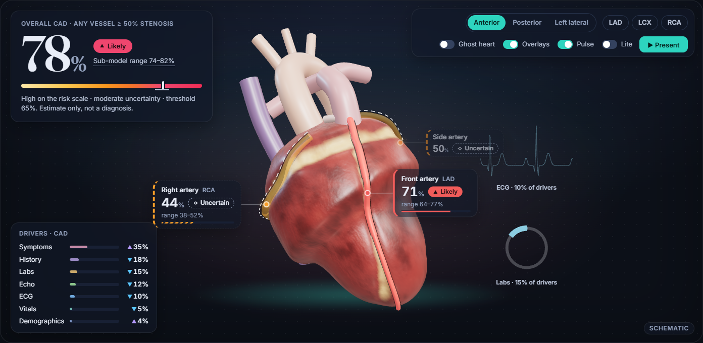
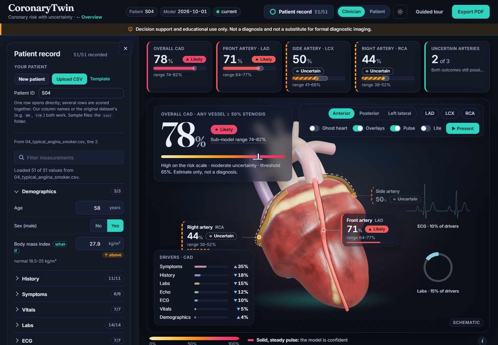

# CoronaryTwin

**Multimodal AI Hackathon 2026, Track A: Cardiovascular Risk Visualization & Prediction**

> A living 3D coronary "twin" that shows **where** risk sits, **how sure** the model is,
> **why** it thinks so, and **what would change it**.

> ⚠️ **For decision support and educational purposes only. Not a substitute for formal
> diagnostic imaging or clinical judgment.**

CoronaryTwin predicts overall coronary artery disease (CAD) and stenosis in the LAD, LCX
and RCA from routine clinical data, then shows each artery as a separate 3D object
colored by its calibrated probability, with uncertainty, SHAP explanations and what-if
sensitivity analysis.

## Status

| # | Module | Status |
|---|---|---|
| 00 | Overview, repo skeleton, shared contracts, mock API | ✅ Done |
| 01 | Data & preprocessing, leakage guard, `features.yaml` | ✅ Done ([data report](docs/data_report.md)) |
| 02 | Four calibrated models, nested CV, conformal | ✅ Done ([model card](docs/MODEL_CARD.md)) |
| 03 | SHAP, grouping, what-if | ✅ Done ([report](docs/explainability_report.md)) |
| 04 | FastAPI with real models | ✅ Done |
| 05 | 3D heart and vessels | ✅ Done ([assets](docs/ASSETS.md)) |
| 06 | Clinical dashboard | ✅ Done |
| 07 | Integration, tests, deployment | ✅ Done ([extending](docs/EXTENDING.md)) |
| 08 | Safety, docs, demo | ✅ Safety layers and [documentation PDF](docs/CoronaryTwin_documentation.pdf) done |
| 09 | Specialities: next best test, guided tour, similar cases, OOD warning, cohort view, deeper evaluation | ✅ Done ([experiments](docs/experiments.md)) |
| 10 | Dashboard redesign: calm dark theme, 3D stage with artery callouts, KPI strip, waterfall, Present and Lite modes | ✅ Done |
| 11 | Versus guideline scores, reading reports (multimodal input), comparing visits on the heart | ✅ Done ([below](#additions-module-11), [experiments](docs/experiments.md#versus-guideline-pre-test-probability-scores)) |
| 12 | Navigation sidebar, one-click Try Demo, generated PDF report | ✅ Done ([below](#sidebar-demo-and-pdf-report-module-12)) |

## The seven pillars

1. **Uncertainty-aware arteries.** Hue shows probability. Pulse speed, opacity and a dashed outline show uncertainty.
2. **Explanations on the anatomy.** SHAP group totals appear as halos and glows in the 3D scene.
3. **What-if sliders.** Changing a modifiable input recolors the arteries live. This shows model sensitivity, not advice.
4. **Coherence layer.** When the overall and vessel models disagree, the app flags it.
5. **Calibration and conformal prediction.** Probabilities are honest, and "Uncertain" is an explicit outcome.
6. **Privacy by design.** Patient inputs and patient IDs are never stored or logged; the database keeps only anonymous prediction outputs, and a test checks this. (Running the models in the browser with ONNX is future work.)
7. **Two audiences.** A clinician view and a plain-language patient view.

## Architecture

```
  Form/CSV  ->  React + R3F (web/)  --POST /predict, /whatif-->  FastAPI (app/)
                 input form                                       schema validation
                 3D scene          <---- JSON contract ----      model registry
                 dashboard                                          |
                                                 4 calibrated models + conformal + SHAP
```

When the user edits a value, the frontend calls the API after a short debounce. The API returns probabilities and explanations, and a single shared store updates the 3D colors and every dashboard panel together.

## Run it

**With Docker (one command):**

```bash
docker compose up --build        # → http://localhost:8080  (API docs: http://localhost:8000/docs)
```

`web` is nginx serving the built frontend and proxying `/api` to `api` (FastAPI with the committed trained models), so
everything is same-origin. If a port is taken, set `WEB_PORT=8081 API_PORT=8010 docker compose up --build`.

**Locally** (Python 3.13, Node 24):

```bash
python tasks.py setup     # .venv with pinned dependencies (requirements.txt)
python tasks.py serve     # API on http://127.0.0.1:8000 (docs at /docs)
python tasks.py web       # frontend on http://localhost:5173, proxies /api to the API
```

If port 8000 is busy, run the API with `--port 8010` and start the frontend with `API_TARGET=http://127.0.0.1:8010`.
`make <task>` works too on systems that have `make`.

## Specialities (module 09)

| # | Speciality | Where | How |
|---|---|---|---|
| S3 | **Next best test** | Panel under the 3D view, shown when values are missing | `POST /next-best-test` ([src/nextbest.py](src/nextbest.py)) fills each blank (and each blank test, e.g. the whole echo) with values from the 25 most similar training patients, then ranks by how far the four estimates could still move. Ranks by model uncertainty, not clinical necessity. |
| S4 | **Deeper evaluation** | Model trust tab, *Deeper evaluation* | [src/experiments.py](src/experiments.py): paired-bootstrap family comparison, ablation by feature group, decision curves, learning curves, calibration methods, engineered features, noise robustness, OOD and next-best-test checks → `artifacts/experiments.json`, [docs/experiments.md](docs/experiments.md) |
| S5 | **Guided tour** | *Guided tour* button in the header, or `?tour=1` | Loads a real dataset patient when none is loaded, then runs Present mode (module 10): overview, each artery, why, what-if. |
| A2 | **Similar cases** | *Why this estimate* tab (clinician view) | `POST /similar`: the 5 nearest training patients in a SHAP-weighted space, matched only on recorded values, shown as coarse summaries (age band, sex, key findings) with their outcomes |
| A3 | **Out-of-distribution warning** | Above the 3D stage, in the PDF and per batch row | `ood` in every `/predict` response: values beyond the training range, plus a Mahalanobis (Ledoit-Wolf) check for unusual combinations at a ~1% false-alarm rate |
| A4 | **Cohort view** | Upload a multi-row CSV | Cohort overview: average estimate and Likely/Uncertain/Unlikely counts per artery, plus how many patients are flagged |

What each check showed is in [docs/experiments.md](docs/experiments.md). For example, the top-ranked next test was the single most informative
of the blanked tests far more often than chance. A Hindi patient view (A6) is **not** included: the spec requires review of medical wording
by a native speaker, and machine-translated clinical text should not ship without it.

## Additions (module 11)

| Addition | Where | How |
|---|---|---|
| **Versus guideline scores** | Model trust tab (*Versus what doctors use today*), a card in *Why this estimate*, a line in the hero, the PDF | [src/baselines.py](src/baselines.py) implements the pre-test probability scores clinicians use today: ESC 2019 (Table 5), ESC 2013 / updated Diamond-Forrester, CAD Consortium basic and clinical. It compares them with the out-of-fold model estimates on the same 303 patients (paired-bootstrap ΔAUC, net reclassification, decision curve), plus a clinical model refitted on this data in the same CV. Every `/predict` response carries `guideline`. |
| **Read reports** (multimodal input) | *Read reports* in the patient record | `POST /extract` ([src/extract.py](src/extract.py)) reads lab, ECG, echo and referral reports (PDF, photo or scan, text). It uses the PDF text layer or on-device OCR (RapidOCR, ONNX models in the wheel, no network), then rules for synonyms, negation ("no ST elevation") and unit conversion (mmol/L, µmol/L, g/L, ×10⁹/L), and checks against the `features.yaml` ranges. Each value is proposed with the line it came from, and the user confirms it before it enters the record. Files are processed in memory and never stored. Optional: Claude vision (`claude-opus-5-5`, structured output), enabled only with `CORONARYTWIN_CLAUDE_EXTRACT=1` and Anthropic credentials, because it sends the files to Anthropic. The same unit and range checks apply. Sample reports for one invented patient are in [samples/reports/](samples/reports/) (`node web/scripts/make_sample_reports.mjs`). |
| **Compare visits** | Bar above the 3D stage | *Save as visit 1*, update the record (new values, or newer reports), then scrub or ▶ play between the two. The arteries, callouts, KPI tiles and hero follow one slider. Both ends are real model estimates; positions in between only blend the colors. Kept in memory only. |

On overall CAD, CoronaryTwin ranks patients better than every published score, by +0.10 AUC over ESC 2019 (95% CI +0.06 to +0.15)
and +0.05 over CAD Consortium with risk factors (+0.01 to +0.08). Against a clinical model refitted on this data the gain is
+0.02 (−0.01 to +0.05): similar ranking, but more cautious at the extremes. For LCX and RCA the model is **not** reliably
better than these simple baselines, and the app says so. Full tables: [docs/experiments.md](docs/experiments.md#versus-guideline-pre-test-probability-scores).

## Sidebar, demo and PDF report (module 12)

- **Sidebar:** a 240px navigation rail with OVERVIEW (Estimate, 3D heart, Method, Guided tour, Project overview), ANALYSIS
  (Why, What-if, Model trust) and REPORTS (Patient summary, Read reports, Export PDF) sections. Patient record, theme and
  demo status sit at the bottom. The active item follows the scroll position and the selected tab. The rail collapses to
  72px icons with tooltips (the choice is remembered), and below 768px it becomes a drawer opened from the ☰ button.
- **▶ Try demo** (top bar or sidebar) loads the five sample patients listed in [csv/demo.json](csv/demo.json), served by
  `GET /demo-set`: low risk, moderate risk, high risk, an edge case and a mixed case. A *Demo* switcher picks the sample, and
  *Exit demo* returns to an empty report. A missing or broken file is skipped with a message.
- **Export PDF** downloads a generated A4 report ([web/src/report/pdf.ts](web/src/report/pdf.ts), jsPDF + autoTable, loaded on
  first use). It has a cover header (patient, date, report ID, model version, *Demo data* when relevant), estimate cards and a
  plain-language summary, the 3D view, vector charts (estimates with sub-model ranges, top drivers, guideline scores), the full
  measurements table with source (entered / report / imputed), findings, and a footer with disclaimer and *Page X of Y*.
  Sections never split across pages. It always reports exact model output; what-if results are labeled.

## Dashboard design (module 10)

- **Look:** a cool dark slate by default (light theme via the sun/moon button), one teal accent, and the risk ramp
  (pale yellow → orange → rose) used **only** for risk. Two fonts: Fraunces for the title and the hero number, and Inter
  for everything else. No text is smaller than 12 px. The ramp's top color is #F02D55 rather than the spec's #FF3B5C, so
  the colors keep getting darker as risk rises (color-blind ordering, tested).
- **Stage:** the 3D heart fills a large rounded stage. Floating over it are the overall estimate, a glass toolbar (views,
  artery chips, Ghost/Overlays/Pulse/Lite toggles, *Present*), a drivers card, and a **callout on each artery** (name,
  percent, status pill, range) with a leader line. Selecting an artery opens a **detail panel** with its top drivers, a
  what-if slider for its strongest modifiable driver, and links to the full explanation, next best test and similar cases.
- **KPI strip** across the top: overall, one tile per artery, and how many arteries are uncertain. Tiles select arteries.
- **Ranges:** every estimate shows a **sub-model range**, the lowest and highest probability among the 5 calibrated
  fold models it averages (`range` in the API). It shows how much they disagree. It is labeled as such and is **not**
  a confidence interval.
- **Patient record** is a drawer. It docks beside the report on wide screens and slides over on small ones.
- **Why this estimate:** a **waterfall** from the average patient to this patient's model score, in the model's own
  units (log-odds, or probability points for random forest), so the bars add up exactly. No percent steps are made up.
- **Present mode** (`▶ Present` on the stage, or *Guided tour*): six steps (overview, LAD, LCX, RCA, why, what-if).
  Captions are generated from the patient's numbers (tested in `web/src/present.test.ts`). Space or arrow keys move
  between steps, Esc exits, and steps auto-advance every 9 s with a pause button.
- **Life and performance:** count-up numbers, a decorative heartbeat (labeled illustrative), and an idle camera drift that
  stops at the first touch. **Lite mode** turns off blur, glow, the heartbeat and the drift but keeps all information. It
  switches on automatically when the frame rate stays under 14 fps. Reduced-motion settings are respected.
- **Honesty:** the safety banner stays visible in every mode, the stage carries a *Schematic* tag, and uncertain
  arteries keep their dashed and hatched look everywhere. Explanation colors are violet and blue, never risk colors.
- **Mobile:** the KPI tiles scroll sideways, panels flow above and below a 50vh stage, and callouts shrink to small chips.
  The page has no horizontal scroll at 390 px.

## Use your own patients

The report has no built-in demo patients: it starts empty (only the *Guided tour* loads one real dataset patient, on request), and every estimate comes live from the trained models for the patient you enter or upload. The landing page hero shows one of the four real dataset patients, scored live and labeled as such, without loading it into the report unless the visitor clicks *Open this patient in the report*. To try it, use the 50 synthetic sample files in [csv/](csv/) (see [csv/README.md](csv/README.md)):

1. **Template:** use *Template* in the patient record, or *Download template* on the overview page. It is a CSV with all 51
   measurements and an example row.
2. **Fill one row per patient.** Our column names (`st_elevation`) or the original dataset's (`St Elevation`, `DM`) both
   work, and so do encoded or raw values (`1/0`, `Y/N`, `Male/Fmale`, `LBBB`, `mild`). Comma, semicolon and tab separators
   are all accepted. Leave unknown values blank: they are imputed and flagged.
3. **Upload CSV.** One row opens directly in the report. Several rows are scored together (`POST /predict/batch`), each
   problem is listed per row and cell, any patient can be opened, and the estimates download as CSV.
   You can also click *New patient* and type values in.

Uploaded data goes only to your own API and is not stored or logged. This is a research prototype without external
validation, so do not use it for clinical decisions.

## Reproduce from scratch

The trained weights, manifest, metrics and SHAP artifacts are committed, so the steps above work without training.
To rebuild everything:

| Step | Command | Expected result |
|---|---|---|
| 1. Data | `python tasks.py data` | `rows=303 features=51`. Positive rates: CAD 71.3%, LAD 58.4%, LCX 39.3%, RCA 37.6%. Audit: 0 flagged features. |
| 2. Train | `python tasks.py train` | About 1 h on 4 CPU cores (resumable). Selected models: CAD logistic regression (AUC 0.92), LAD random forest (0.85), LCX random forest (0.72), RCA logistic regression (0.72). Conformal coverage about 90.5%. Writes `docs/MODEL_CARD.md`. |
| 3. Explain | runs after train (`python tasks.py explain`) | SHAP stability ρ between 0.78 and 0.92 for all four models. Writes `docs/explainability_report.md`, the demo patients and `artifacts/casebase.joblib`. |
| 3b. Experiments | `python tasks.py experiments` | About 10 min. Writes `artifacts/experiments.json` and [docs/experiments.md](docs/experiments.md). |
| 4. Check | `python tasks.py check` | `OK: all registries agree` |
| 5. Test | `python tasks.py test` | All Python tests pass, then the web tests. With the stack running: `cd web && npm run e2e` |

Seeds are fixed (`config/settings.yaml` → `project.seed`), so the same environment reproduces the same numbers.
For a quick sanity run, `python -m src.train --fast` takes about 1 minute and gives slightly different metrics.

## Integration (module 07)

- **Three registries** (`features.yaml`, `artifacts/registry.json`, `web/src/anatomy.json`) plus `config/settings.yaml`
  drive the form, validation, models, explanations and 3D scene.
  [scripts/check_registries.py](scripts/check_registries.py) cross-checks all of them.
- **Extending:** add a feature, a model type or a vessel by editing registries. See [docs/EXTENDING.md](docs/EXTENDING.md).
  [tests/test_extensibility.py](tests/test_extensibility.py) shows that a new feature becomes a validated API field and
  a preprocessing input with no code change, and that a vessel added in only one place is caught.
- **Tests:**

| Test | Checks |
|---|---|
| `test_leakage.py` | Banned columns never reach `fit` |
| `test_api.py` | Bad or out-of-range input is rejected, response shape is correct, probabilities lie in [0, 1], latency, batch, mock mode |
| `test_contract.py` | Model, API, anatomy and fixture vessel IDs match |
| `test_explain.py` | SHAP is additive for every model family, and group sums equal feature sums |
| `test_api.py::test_predict_demo_contract` | Smoke test: demo patients return valid output end to end |
| `test_extensibility.py` | Registry drift is caught, and a new feature works without code changes |
| `test_db.py` | SQLite: reference tables, every prediction logged with outputs only (no input values, no patient ID), batch rows, disabled mode, `view_db.py` is read-only |
| `test_single.py` | Single-container app: API under `/api`, website at `/`, single-page fallback, no path escape, gzipped and cached assets |
| `web/e2e/smoke.spec.ts` (Playwright) | The judge path in a real browser: upload, KPI/hero/callouts agree, detail panel, waterfall, trust tab, guided tour with data-driven captions, keyboard Escape/focus return |
| `test_specialities.py` | OOD fires beyond the training range but stays quiet on real patients, similar cases are coarse and sorted, next-best-test ranks only missing values and is deterministic, cohort summary counts add up |
| `web/src/**/*.test.ts` | Color and uncertainty encoding, surface projection, vessel-ID contract, form validation |

- **CI:** [.github/workflows/ci.yml](.github/workflows/ci.yml) runs the registry check, Python tests and web
  typecheck/tests/build, then builds both images and smoke-tests the running stack through nginx.
- **Real-time flow:** an edit triggers a debounced `/predict` (250 ms). One store update recolors the 3D scene and
  refreshes every panel, and the previous result stays visible while the new one loads.

## Deploy

- **One container** (Hugging Face Spaces with the Docker SDK, Render, Fly.io, a VM): `docker build -f Dockerfile.single -t coronarytwin .`
  then `docker run -p 7860:7860 coronarytwin`. The website is served at `/` and the API at `/api` ([app/single.py](app/single.py));
  `$PORT` is honored.
- **Any Docker host, two containers:** `docker compose up -d --build`, then expose port 8080.
- **Split hosting:** build `web/` with `VITE_API_BASE=https://<api-host>` (static hosting, for example Vercel), and run
  the API image elsewhere. Add the frontend origin to `api.cors_origins` in `config/settings.yaml`.
- **Before judging:** hosted containers can cold-start slowly. Open `/api/health` a minute ahead, because the API loads
  the models and SHAP explainers at startup. Keep a recorded walkthrough as a backup in case the network fails.

### Links for judges

- `/?tour=1#dashboard`: opens the report and starts the guided tour (loads a real dataset patient, then Present mode).
- `/?fps=1#dashboard`: renders continuously and shows the frame rate, to check a laptop (36–44 fps with all effects and
  60 fps in Lite mode on Intel HD Graphics 620; see [docs/ASSETS.md](docs/ASSETS.md)).
- [docs/CoronaryTwin_documentation.pdf](docs/CoronaryTwin_documentation.pdf): the 6-page documentation (source
  `docs/documentation.html`; rebuild with `cd web && node scripts/build_docs_pdf.mjs`).

## API (module 04)

| Method and path | Purpose |
|---|---|
| `POST /predict` | `{"features": {...}}` or `{"demo": "high"}` → probabilities, conformal sets, uncertainty, thresholds, coherence, per-vessel SHAP, list of imputed features |
| `POST /whatif` | Same input plus `overrides` (modifiable features only) → base, what-if and deltas |
| `POST /counterfactual` | `{"demo"|"features", "target": "LAD"}` → smallest modifiable change below the threshold |
| `POST /predict/batch` | CSV upload (≤ 500 rows). Invalid rows are listed in `errors`, and `summary` holds the cohort overview |
| `POST /next-best-test` | `{"features": {...}, "target"?: "LAD"}` → missing tests and measurements, ranked by how much they could move the estimate |
| `POST /similar` | `{"features": {...}, "k": 5}` → nearest training patients as coarse summaries with outcomes |
| `GET /experiments` | Deeper evaluation results for the Model trust tab |
| `GET /features` | Feature registry, groups, modifiable list and data ranges for the auto-built form |
| `GET /demo-patients` | Four dataset patients for API scripting, tests and the guided tour (the website never loads them on its own) |
| `GET /metrics`, `GET /explanations/global` | Model-trust tab data |
| `GET /log/summary` | Aggregate counts from the privacy-safe prediction log (outputs only) |
| `GET /model-info`, `GET /health` | Version, thresholds and mode |

- **Validation:** `PatientInput` is generated from `features.yaml`. Out-of-range values, unknown keys and invalid
  categories return 422. Every field is optional: missing values are imputed and listed in `imputed`.
- **Speed:** models and SHAP explainers load once at startup, and each request takes about 0.2 s on CPU. Every
  fitted preprocessing step is compiled to numpy ([src/fastpath.py](src/fastpath.py)) and checked at load time
  to produce the same predictions as scikit-learn, falling back to scikit-learn otherwise.
- **Privacy:** inputs and patient IDs are never stored or logged. The SQLite log keeps outputs only (see *Database*), and CORS allows only the frontend origin.

## Database (SQLite)

The API keeps a single SQLite file, `data/coronarytwin.db`, created at startup ([app/db.py](app/db.py)).

| Table | Contents |
|---|---|
| `features` | The feature registry: name, label, type, group, unit, modifiable |
| `models` | One row per served model: version, family, threshold, conformal qhat, CV ROC-AUC with CI, Brier, coverage |
| `dataset` | The public training data (303 rows), when `data/processed/coronary.csv` is present |
| `prediction_log` | One row per scored patient (`/predict` and each `/predict/batch` row): time, endpoint, model version, number of missing values, OOD and coherence flags, latency |
| `prediction_results` | Per log row and target: probability, state, uncertainty |

**Privacy-safe by design:** the log stores model **outputs only**. No input values and no patient ID are written, so
nothing in the database can identify or reconstruct a patient (`tests/test_db.py` checks this). Writing is best effort and
never fails a prediction.

```bash
python view_db.py                 # tables, row counts, latest predictions   (or: python tasks.py db)
python view_db.py --log 50        # latest 50 predictions, all targets per line
python view_db.py --stats         # states and mean probability per target
python view_db.py --table models  # any table
python view_db.py --sql "SELECT target, AVG(prob) FROM prediction_results GROUP BY target"
python view_db.py --log 500 --csv log.csv
```

`view_db.py` opens the database read-only. `GET /log/summary` returns the same aggregates over HTTP. Set
`CORONARYTWIN_DB=<path>` to move the file or `CORONARYTWIN_DB=off` to disable it. In Docker Compose it lives in the
`db-data` volume; in the single-container image it is inside the container (mount a volume at `/srv/data` to keep it).

## Mock mode

If there are no trained artifacts, or `CORONARYTWIN_MOCK=1` is set, `/predict` and `/whatif` serve the
fixtures in [fixtures/responses/](fixtures/responses/) using the same response contract. This lets frontend
work proceed without models.

```bash
curl -X POST localhost:8000/predict -H "Content-Type: application/json" -d '{"demo": "high"}'
```

| Demo | What it exercises |
|---|---|
| `low` | All vessels unlikely |
| `mixed` (default) | LAD and LCX *Uncertain* (conformal set holds both labels) |
| `high` | LAD and RCA likely, LCX uncertain, strong ECG/Echo drivers |
| `discordant` | Overall CAD high but no vessel high, so the coherence flag is set |

To regenerate the fixtures, run `python tasks.py mock`. The numbers are invented, but they are consistent with the conformal, coherence and SHAP-grouping rules.

## Single sources of truth

| File | Drives |
|---|---|
| [config/settings.yaml](config/settings.yaml) | Vessel IDs, banned input columns, SHAP groups, conformal α, coherence thresholds, CORS, disclaimer text |
| [features.yaml](features.yaml) | The 51 model inputs: canonical names, raw-column mapping, encodings, groups, valid and normal ranges, what-if flags, patient text, plus excluded columns with reasons |
| `artifacts/registry.json` (module 02) | Model paths, thresholds, conformal quantiles, version |
| [web/src/anatomy.json](web/src/anatomy.json) | Vessel meshes: IDs, labels, curve control points, radii |

The strings **`LAD`, `LCX`, `RCA` are the same everywhere**: settings, model files, API keys,
mesh names, store keys and UI labels. [tests/test_contract.py](tests/test_contract.py)
fails if they drift apart.

Shared rules live in [src/contract.py](src/contract.py): how a conformal set maps to Likely, Unlikely or Uncertain, and when the coherence flag is raised. The response models live in [app/schemas.py](app/schemas.py).

## Response contract (`POST /predict`)

```json
{
  "patient_id": "demo-mixed",
  "overall": {"prob": 0.68, "uncertainty": 0.64, "set": ["CAD"], "state": "Likely", "label": "CAD likely"},
  "vessels": {
    "LAD": {"prob": 0.58, "uncertainty": 0.84, "set": ["CAD", "No CAD"], "state": "Uncertain"},
    "LCX": {"prob": 0.44, "uncertainty": 0.88, "set": ["CAD", "No CAD"], "state": "Uncertain"},
    "RCA": {"prob": 0.22, "uncertainty": 0.44, "set": ["No CAD"], "state": "Unlikely"}
  },
  "coherence": {"flag": false, "note": ""},
  "explanations": {
    "LAD": {
      "groups": {"Demographics": 0.271, "History": 0.144, "Symptoms": 0.0, "Vitals": 0.072, "Labs": 0.192, "ECG": 0.16, "Echo": 0.088},
      "features": [{"name": "t_inversion", "value": 1, "shap": 0.16, "group": "ECG", "range_status": null}],
      "text": "Largest influences on the LAD estimate: T-wave inversion (raised), ..."
    },
    "CAD": {}, "LCX": {}, "RCA": {}
  },
  "model_version": "mock-0",
  "disclaimer": "For decision support and educational purposes only. ..."
}
```

(The values above are abbreviated. See the fixture files for complete responses.)

## Data and leakage guard (module 01)

- **Dataset:** Extension of Z-Alizadeh Sani (UCI id 411): 303 patients and 59 columns, with no missing values. `python tasks.py data` downloads it into `data/raw/`.
- **Targets:** CAD (from `Cath`, 71.3% positive), LAD (58.4%), LCX (39.3%) and RCA (37.6%).
- **Inputs:** 51 features in 7 SHAP groups: Demographics, History, Symptoms, Vitals, Labs, ECG and Echo. `History` and `Symptoms` extend the brief's five groups, because chest-pain type, DM and HTN are strong predictors that fit none of the original five.
- **Excluded:** the four label columns, plus `Weight`, `Length` and `Obesity` (BMI is computed exactly from them) and `Exertional CP` (constant). The reasons are recorded in `features.yaml`.
- **Leakage guard:** [src/leakage_guard.py](src/leakage_guard.py) builds X from a whitelist and also blocks every banned column. [tests/test_leakage.py](tests/test_leakage.py) enforces this. Preprocessing is an unfitted `ColumnTransformer` that is fitted inside CV folds.
- **Audit:** no input's single-feature ROC-AUC comes close to 1.0 (the highest is typical chest pain at 0.80). Overall CAD equals "any stenotic vessel" for 302 of 303 patients. See [docs/data_report.md](docs/data_report.md).

## Explainability (module 03)

- **Per-model SHAP** ([src/explain.py](src/explain.py)): LAD, LCX, RCA and CAD each get their own drivers. One-hot
  dummies are summed back to the original feature, and group totals are exact sums. Tests check that SHAP is
  additive for all four model families.
- **Wording:** a clinician sentence (feature, value, signed contribution) and a patient sentence built from
  `patient_text` in `features.yaml`. Absent findings are worded as absent ("No heart murmur").
- **What-if and counterfactuals:** only `modifiable` features can change. The counterfactual search finds the
  smallest change (in SD) that moves a vessel below its threshold, staying inside the observed data range and
  only moving toward the normal range. Every result carries *"Shows model sensitivity, not medical advice."*
- **Stability:** feature rankings are compared across 5 refits (Spearman ρ and top-5 overlap).
- **LIME cross-check** (`python -m src.lime_check`): on 20 patients per model, LIME and SHAP share 60–70% of their
  top-3 drivers (chance about 6%).
- **Serving artifacts:** `artifacts/shap_background.csv`, `feature_stats.json`, `shap_global.json` and
  `shap_stability.json`. [src/inference.py](src/inference.py) is the shared model loader for the API.

## 3D visualization (module 05)



- **Procedural anatomy** ([web/src/scene/heartShape.ts](web/src/scene/heartShape.ts)): an analytic heart surface. Artery
  paths from `anatomy.json` are projected exactly onto it, so they never float off the heart from any angle (this is tested).
  No third-party meshes are used; see [docs/ASSETS.md](docs/ASSETS.md).
- **Encoding:** hue shows the calibrated probability on a color-blind-safe yellow-orange-red ramp. Uncertainty is shown by
  pulse speed and irregularity, and an *Uncertain* conformal state also makes the vessel translucent with a dashed outline.
  Color is always paired with numbers and words.
- **Interaction:** rotate, zoom, pan and touch. Hover shows a tooltip. Clicking a vessel selects it, flies the camera to it and
  shows its own drivers. There are Anterior, Posterior and Left-lateral presets, ghost mode, keyboard-reachable vessel
  buttons, and deep links for view settings (`?select=LCX&view=posterior&ghost=1`).
- **Explanation overlays (schematic):** an Echo wall glow, an animated ECG trace and a Labs gauge, sized by each group's
  share of |SHAP| and colored by direction, plus side badges for the other groups.
- **Performance:** `frameloop="demand"`, DPR capped at 1.5, pulses capped at about 30 fps and paused in hidden tabs, and
  about 22k triangles with no textures. Without WebGL, a 2D SVG schematic uses the same colors.
- **One store** ([web/src/store/risk.ts](web/src/store/risk.ts)): the 3D scene and the panels read the same Zustand state.
  If the API is offline, the app falls back to the bundled fixtures and shows a "Mock data" badge.
- If port 8000 is taken, run the API elsewhere and set `API_TARGET=http://127.0.0.1:8010` for `npm run dev`.

## Clinical dashboard (module 06)



The visual design is described under *Dashboard design (module 10)* above: a dark slate theme (with a light theme),
one teal accent, Fraunces for the title and hero number and Inter for everything else. The answer comes first
("78% · Likely"). The risk ramp is the only strong color, and the state pills differ in shape as well as color:
a solid pill for Likely, a dashed outline for Uncertain and a faint tinted one for Unlikely. Motion animates specific
properties with a strong ease-out and skips animation on frequent actions.

| Area | What it does |
|---|---|
| **Patient input** | Auto-built from `GET /features` and grouped by measurement family. Shows units, normal ranges and above/below flags. Validates on blur, with errors under each field and a linked error summary. Missing values are marked *imputed*. New patient, CSV upload (one or many patients) and a downloadable template. Every change re-predicts after a 250 ms debounce. |
| **3D view** | Module 05, lazy-loaded so the rest of the page paints first. Initial bundle: 105 KB gzipped. |
| **Hero, KPI strip and callouts** | The overall estimate as a large headline on the stage, with a 0–100 ramp, threshold tick and sub-model range. The KPI strip and the artery callouts give each vessel its percent, state pill and range. Clicking a tile or callout selects the vessel in 3D and opens its detail panel. |
| **Explain** | Diverging bar tables (group, then measurement) per model, with value, range status, direction and SHAP value, as accessible tables. Wording switches between clinician and patient language. |
| **What-if** | Sliders for modifiable features only, within the observed data range. Shows before/after per estimate and recolors the arteries live. The counterfactual "smallest change" search has *Try it*. The caption is always visible. |
| **Model trust** | CV metrics with 95% CIs, ROC and calibration plots (dash patterns as well as color), a subgroup × model matrix, coverage and limits. |
| **Patient summary** | Plain-language traffic-light summary with a "talk to your doctor" message. |
| **Safety** | Sticky disclaimer banner, a first-use acknowledgement modal, card footers, and an *Export* option that prints a one-page summary (3D snapshot, estimates, drivers, imputed values) with the disclaimer. |

Deep links: `?page=dashboard&select=LCX&tab=explain|whatif|trust|patient&audience=patient&view=posterior&ghost=1&noack`.
Accessibility: skip link, WAI-ARIA tabs with arrow keys, visible focus rings, `role="switch"` toggles, live regions for
updates, reduced-motion support, and no horizontal scroll at 390 px (checked). Screenshots are in `docs/figures/dashboard_*.png`.

## Repository layout

```
config/settings.yaml   project-wide settings (vessel IDs, thresholds, disclaimer)
src/                   ML code: config.py, contract.py, data.py, leakage_guard.py, audit.py,
                       models.py, train.py, calibrate.py, conformal.py, evaluate.py, report.py,
                       inference.py, explain.py, fastpath.py, demo_patients.py
app/                   FastAPI: main.py, schemas.py, registry.py, predict.py
csv/                   50 synthetic sample patient files for the upload (clinical profiles, data-quality cases, batches)
fixtures/              mock API responses and the feature-registry payload used by web tests
artifacts/             models/, metrics.json, feature_manifest.json, registry.json
data/                  raw/, processed/ (not committed)
web/                   React + R3F app: src/components/ (InputForm, RiskCards, ShapPanel, WhatIf, TrustTab,
                       PatientView, Disclaimer, ...), src/scene/ (Heart, Vessel, Overlays, CameraRig, colorScale, ...),
                       src/store/risk.ts, src/api/, src/anatomy.json
scripts/               utilities (mock fixture generator)
tests/                 contract and API tests
notebooks/, docs/      EDA, figures, MODEL_CARD.md, documentation source
samples/reports/       invented lab, ECG, echo and referral reports for the report-reading feature
```

## Honesty and limitations

- The dataset has **no lesion-level or pixel-level labels**. The arteries are colored from vessel-level probabilities, so the 3D mapping is **schematic**.
- **Region with RWMA** is an *input feature*. It is not a map of where disease is.
- SHAP explains *model behavior*. It does not explain biological cause.
- About 303 patients from a single source is a small sample. The results are not clinical proof.
- This app is for **decision support and education only**.

## Data

Alizadehsani, R., Roshanzamir, M., & Sani, Z. (2013). *Extention of Z-Alizadeh sani dataset* [Dataset]. UCI Machine Learning Repository. https://doi.org/10.24432/C5461K
