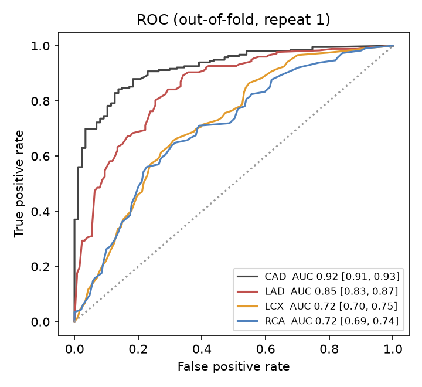
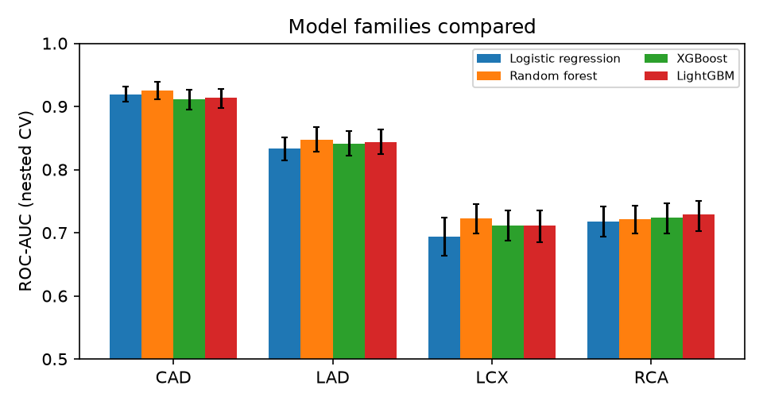
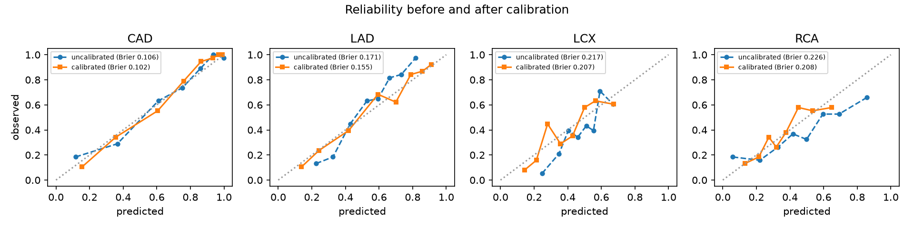

# Model card: CoronaryTwin risk models

Generated by `python -m src.report` from `artifacts/metrics.json`. Do not edit by hand.
Version **2026-10-01** (full run, 2026-10-01T18:00:29+00:00).

> **For decision support and educational purposes only. Not a substitute for formal
> diagnostic imaging or clinical judgment.**

## 1. Model details

Four independent binary classifiers: overall CAD, plus ≥50% stenosis in the LAD, LCX and RCA.
Each is a scikit-learn pipeline (imputation → scaling / one-hot → classifier), wrapped in Platt
(sigmoid) calibration with a 5-fold ensemble. Candidate families were
Logistic regression, Random forest, XGBoost, LightGBM. The family for each target was chosen with
the one-standard-error rule: the simplest family whose mean nested-CV AUC is within one SE of the best.

## 2. Intended use

- **In scope:** education, demonstration and decision *support* for clinicians exploring how routine
  clinical measurements relate to coronary findings.
- **Out of scope:** diagnosis, triage or treatment decisions, and any use on patients unlike the training population.

## 3. Data

303 patients from the Extension of Z-Alizadeh Sani dataset
(UCI id 411, DOI 10.24432/C5461K), all from a single source.
51 inputs in 7 groups; `LAD`, `LCX`, `RCA` and `Cath` are excluded by a tested leakage guard.
Positive rates: CAD 71.3%, LAD 58.4%, LCX 39.3%, RCA 37.6%. See `docs/data_report.md`.

## 4. Evaluation method

- **Nested, repeated, stratified CV:** 5×5 outer folds for performance,
  and an inner 3-fold `RandomizedSearchCV` (15 candidates, ROC-AUC) for
  hyperparameters. Preprocessing, tuning and calibration all happen inside the outer-training part.
- **Intervals:** mean over outer folds, with a 95% bootstrap CI (2000 resamples of fold-level values).
  Folds from different repeats share patients, so the intervals are approximate.
- **Threshold:** the highest cut-off with out-of-fold recall ≥ 85%. Screening favors recall,
  because a missed stenosis costs more than a false alarm. The threshold was chosen on the same out-of-fold
  predictions it is evaluated on, so the metrics at that threshold are mildly optimistic.

## 5. Performance

Discrimination and calibration (ROC-AUC and Brier do not depend on the threshold). Metrics are
computed at each target's chosen threshold:

| Target | Model | ROC-AUC | Brier | Threshold | Recall | Precision | F1 | Accuracy |
|---|---|---|---|---|---|---|---|---|
| CAD | Logistic regression | 0.92 [0.91, 0.93] | 0.10 [0.10, 0.11] | 0.65 | 0.85 [0.83, 0.87] | 0.92 [0.91, 0.94] | 0.89 [0.87, 0.90] | 0.84 [0.83, 0.86] |
| LAD | Random forest | 0.85 [0.83, 0.87] | 0.16 [0.15, 0.17] | 0.50 | 0.85 [0.83, 0.88] | 0.79 [0.77, 0.81] | 0.82 [0.80, 0.83] | 0.78 [0.76, 0.80] |
| LCX | Random forest | 0.72 [0.70, 0.75] | 0.21 [0.20, 0.21] | 0.29 | 0.86 [0.83, 0.89] | 0.50 [0.49, 0.52] | 0.63 [0.62, 0.65] | 0.61 [0.59, 0.63] |
| RCA | Logistic regression | 0.72 [0.69, 0.74] | 0.20 [0.20, 0.21] | 0.28 | 0.85 [0.83, 0.88] | 0.48 [0.47, 0.50] | 0.62 [0.60, 0.63] | 0.60 [0.58, 0.62] |

At the default 0.5 cut-off, for comparison:

| Target | Recall @0.5 | Precision @0.5 | F1 @0.5 | Accuracy @0.5 |
|---|---|---|---|---|
| CAD | 0.92 [0.90, 0.93] | 0.89 [0.87, 0.90] | 0.90 [0.89, 0.91] | 0.86 [0.84, 0.87] |
| LAD | 0.85 [0.83, 0.88] | 0.79 [0.77, 0.81] | 0.82 [0.80, 0.83] | 0.78 [0.76, 0.80] |
| LCX | 0.48 [0.45, 0.51] | 0.62 [0.58, 0.66] | 0.54 [0.51, 0.57] | 0.68 [0.66, 0.70] |
| RCA | 0.38 [0.34, 0.41] | 0.61 [0.57, 0.65] | 0.46 [0.42, 0.49] | 0.67 [0.65, 0.69] |

Model families compared (nested-CV ROC-AUC, ✓ = selected):

| Target | Logistic regression | Random forest | XGBoost | LightGBM |
|---|---|---|---|---|
| CAD | 0.919 [0.91, 0.93] ✓ | 0.925 [0.91, 0.94] | 0.911 [0.90, 0.93] | 0.913 [0.90, 0.93] |
| LAD | 0.833 [0.82, 0.85] | 0.848 [0.83, 0.87] ✓ | 0.841 [0.82, 0.86] | 0.844 [0.82, 0.86] |
| LCX | 0.694 [0.66, 0.72] | 0.722 [0.70, 0.75] ✓ | 0.712 [0.69, 0.73] | 0.711 [0.69, 0.74] |
| RCA | 0.718 [0.69, 0.74] ✓ | 0.722 [0.70, 0.74] | 0.724 [0.70, 0.75] | 0.729 [0.70, 0.75] |

### Calibration

| Target | Brier uncalibrated | Brier calibrated |
|---|---|---|
| CAD | 0.11 [0.10, 0.12] | 0.10 [0.10, 0.11] |
| LAD | 0.17 [0.16, 0.18] | 0.16 [0.15, 0.17] |
| LCX | 0.21 [0.21, 0.22] | 0.21 [0.20, 0.21] |
| RCA | 0.22 [0.21, 0.23] | 0.20 [0.20, 0.21] |

### Conformal prediction (α = 0.1, target coverage 90%)

Coverage was measured with cross-conformal evaluation: each fold's q̂ was computed from the other folds'
out-of-fold scores. A prediction set containing both labels is shown as **Uncertain**.

| Target | q̂ | Measured coverage | Uncertain rate |
|---|---|---|---|
| CAD | 0.609 | 90.5% | 11.3% |
| LAD | 0.703 | 90.6% | 34.5% |
| LCX | 0.683 | 90.5% | 57.7% |
| RCA | 0.685 | 90.7% | 55.0% |

### Coherence between models

On out-of-fold predictions, 0 patients (0.0%) were flagged (thresholds: high ≥ 0.7, low ≤ 0.3). The overall-CAD error rate was n/a on flagged patients and 13.5% on unflagged ones.

## 6. Subgroups

Metrics use per-patient out-of-fold probabilities (averaged over repeats) at each target's threshold.
Groups marked ⚠ have fewer than 40 patients or fewer than 10 of either class, and are too small to judge.

| Target | Subgroup | n | Positives | ROC-AUC | Recall | Note |
|---|---|---|---|---|---|---|
| CAD | sex: male | 176 | 130 | 0.90 | 0.85 |  |
| CAD | sex: female | 127 | 86 | 0.95 | 0.88 |  |
| CAD | age: <50 | 58 | 29 | 0.89 | 0.69 |  |
| CAD | age: 50-64 | 150 | 104 | 0.95 | 0.86 |  |
| CAD | age: 65+ | 95 | 83 | 0.87 | 0.94 |  |
| LAD | sex: male | 176 | 110 | 0.85 | 0.86 |  |
| LAD | sex: female | 127 | 67 | 0.84 | 0.88 |  |
| LAD | age: <50 | 58 | 22 | 0.87 | 0.77 |  |
| LAD | age: 50-64 | 150 | 84 | 0.85 | 0.88 |  |
| LAD | age: 65+ | 95 | 71 | 0.73 | 0.89 |  |
| LCX | sex: male | 176 | 77 | 0.74 | 0.86 |  |
| LCX | sex: female | 127 | 42 | 0.72 | 0.86 |  |
| LCX | age: <50 | 58 | 12 | 0.68 | 0.58 |  |
| LCX | age: 50-64 | 150 | 52 | 0.74 | 0.83 |  |
| LCX | age: 65+ | 95 | 55 | 0.54 | 0.95 |  |
| RCA | sex: male | 176 | 75 | 0.68 | 0.85 |  |
| RCA | sex: female | 127 | 39 | 0.78 | 0.90 |  |
| RCA | age: <50 | 58 | 11 | 0.81 | 0.73 |  |
| RCA | age: 50-64 | 150 | 60 | 0.74 | 0.85 |  |
| RCA | age: 65+ | 95 | 43 | 0.65 | 0.93 |  |

## 7. Limitations

- A single source with only ~300 patients, and **no external validation**. Performance on other populations is unknown.
- The labels are vessel-level. There is no lesion or segment location, so the 3D coloring is **schematic**.
- SHAP explanations (module 03) describe model behavior, not biological cause.
- Model selection used the same outer folds that are reported, which adds a small optimistic bias.
- The four models are trained independently and can disagree. The coherence flag makes this visible but does not resolve it.

## 8. Ethical considerations

- There is a risk of over-reliance. The UI shows uncertainty, conformal "Uncertain" states and a persistent disclaimer.
- By default, no patient data is stored by the API.
- Subgroup gaps must be read with the small group sizes above in mind.
