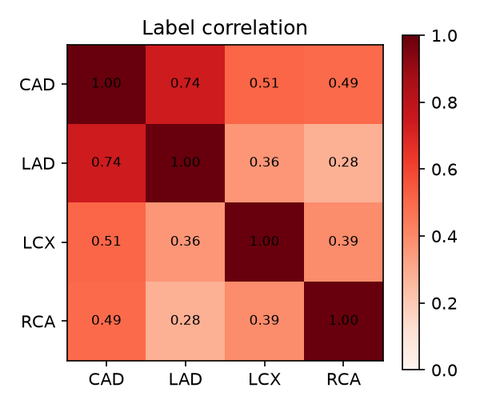
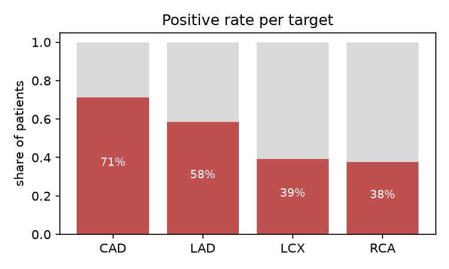
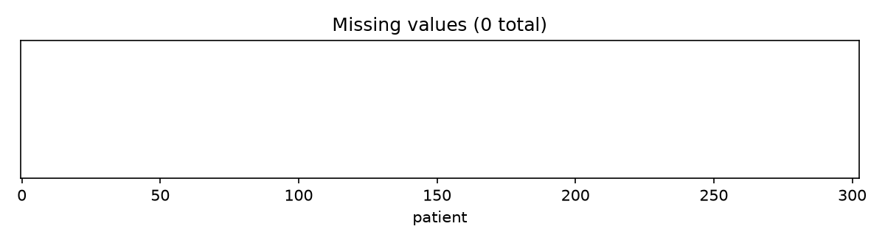
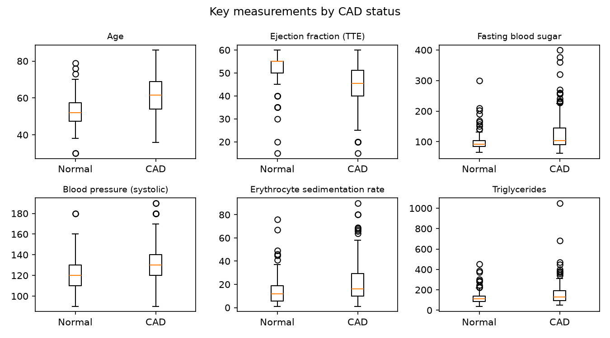

# Data report (module 01)

Generated by `python -m src.audit`. Do not edit by hand.

**Dataset:** Extension of Z-Alizadeh Sani, UCI Machine Learning Repository (id 411, DOI 10.24432/C5461K).
303 patients, 51 model inputs after exclusions, 0 missing values.

## Class balance

| target | positives | negatives | positive rate |
|---|---|---|---|
| CAD | 216 | 87 | 71.3% |
| LAD | 177 | 126 | 58.4% |
| LCX | 119 | 184 | 39.3% |
| RCA | 114 | 189 | 37.6% |

Overall CAD is the majority class, so plain accuracy is misleading. Report ROC-AUC, F1, precision and recall.

## Label consistency

Overall CAD comes from catheterization (`Cath`), and it almost exactly means "at least one stenotic vessel":

| | any vessel stenotic | no vessel stenotic |
|---|---|---|
| CAD | 216 | 0 |
| Normal | 1 | 86 |

1 patient(s) (0-based row 93 of the raw file) are labeled Normal while a vessel is labeled stenotic. These rows are kept as recorded. This near-identity is what the coherence layer (module 02) relies on: a high overall CAD estimate with no high vessel estimate is internally inconsistent.

## Leakage guard

- `LAD`, `LCX`, `RCA` and `Cath` are banned as inputs (`config/settings.yaml`), and derived target names are banned as well.
- Model inputs are built from a whitelist, `features.yaml`, in the order recorded in `artifacts/feature_manifest.json`.
- `tests/test_leakage.py` fails if any banned column can reach a model.
- All preprocessing (imputation, scaling, one-hot encoding) is fitted inside CV folds (`src.data.build_preprocessor`).

### Single-feature audit

Each input was scored alone against each target (direction-free ROC-AUC). A value at or above 0.9 would suggest that a feature encodes the label.
**Flagged features: 0.** None of the inputs look like a hidden label.

Top 12 features by maximum AUC:

| feature | group | CAD | LAD | LCX | RCA |
|---|---|---|---|---|---|
| typical_chest_pain | Symptoms | 0.799 | 0.732 | 0.649 | 0.65 |
| age | Demographics | 0.724 | 0.677 | 0.681 | 0.635 |
| atypical_chest_pain | Symptoms | 0.712 | 0.665 | 0.58 | 0.612 |
| ef_tte | Echo | 0.687 | 0.708 | 0.587 | 0.578 |
| region_rwma | Echo | 0.672 | 0.675 | 0.564 | 0.536 |
| bp | Vitals | 0.661 | 0.596 | 0.617 | 0.561 |
| hypertension | History | 0.656 | 0.591 | 0.588 | 0.575 |
| fbs | Labs | 0.651 | 0.582 | 0.591 | 0.604 |
| neut | Labs | 0.579 | 0.609 | 0.54 | 0.635 |
| esr | Labs | 0.634 | 0.621 | 0.573 | 0.614 |
| diabetes | History | 0.628 | 0.557 | 0.574 | 0.628 |
| lymph | Labs | 0.58 | 0.609 | 0.526 | 0.628 |

The full table is in `artifacts/leakage_audit.csv`.

## Excluded raw columns

| source | reason |
|---|---|
| Cath | Target: overall CAD label from catheterization. |
| LAD | Target: LAD stenosis label. |
| LCX | Target: LCX stenosis label. |
| RCA | Target: RCA stenosis label. |
| Weight | Redundant: BMI is computed exactly from Weight and Length (max error 0.0). |
| Length | Redundant: height, used only to compute BMI. |
| Obesity | Redundant: equals BMI > 25 in 302 of 303 rows. |
| Exertional CP | Constant: every patient has the value N. |

## Feature groups

| group | features |
|---|---|
| Demographics | 3 |
| History | 11 |
| Symptoms | 6 |
| Vitals | 7 |
| Labs | 14 |
| ECG | 7 |
| Echo | 3 |

`History` and `Symptoms` were added to the five groups in the brief. Chest-pain type, diabetes and hypertension are among the strongest predictors, and none of the original groups fits them.

## Figures

