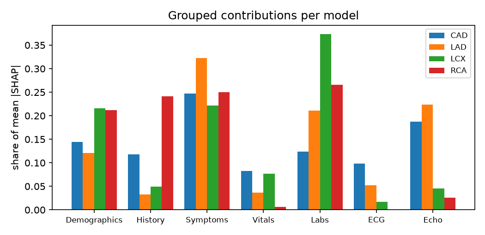
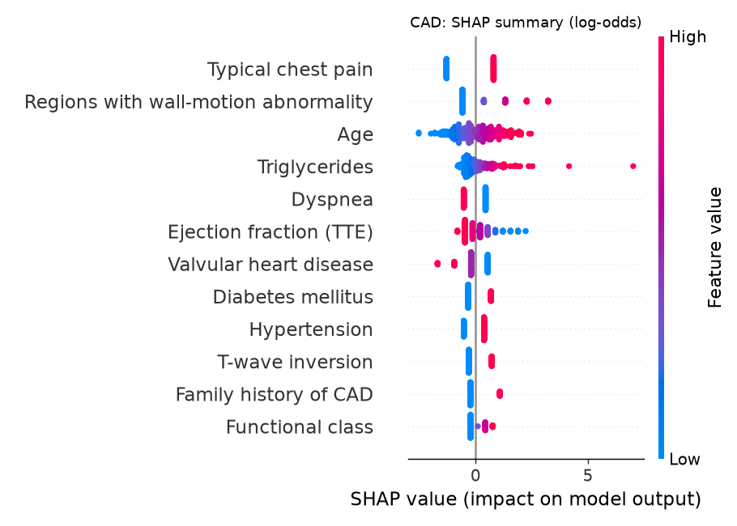
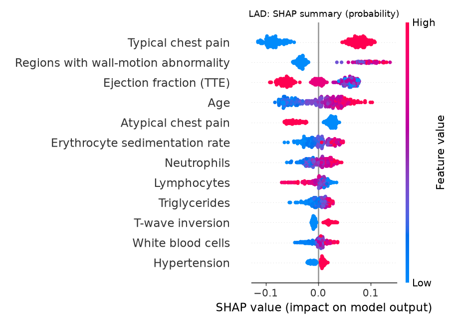
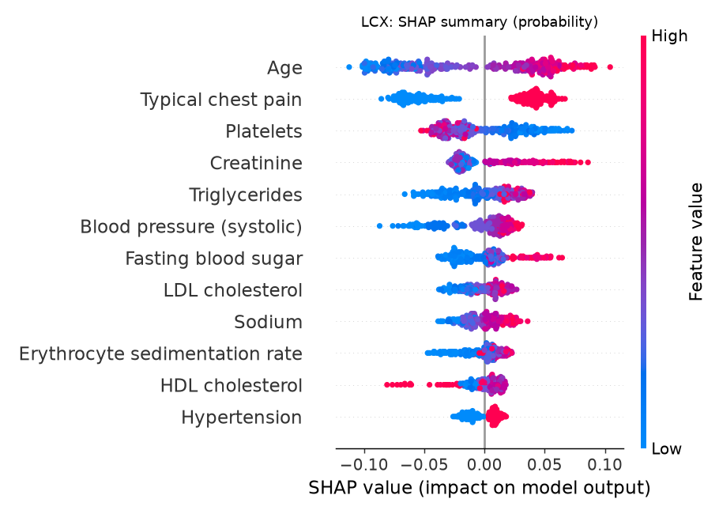
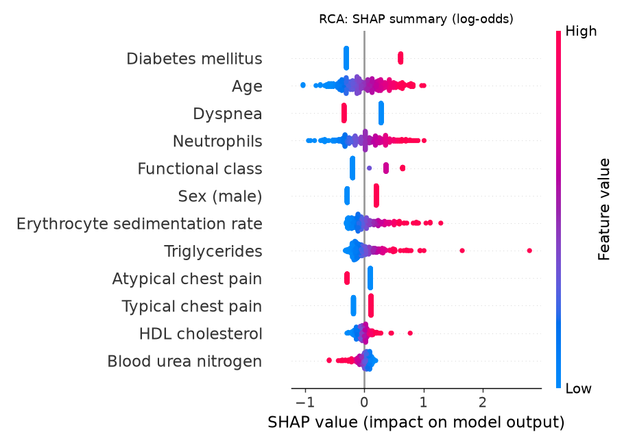

# Explainability report (module 03)

Generated by `python -m src.explain` for model version **2026-10-01**. Do not edit by hand.

> SHAP describes **model behavior**, not biological cause. The what-if and counterfactual tools show
> **model sensitivity, not medical advice**.

## Method

- SHAP is computed separately for each of the four models, so clicking the LAD shows LAD-specific drivers.
- It explains the uncalibrated base model: `LinearExplainer` (with a 100-patient background) for
  logistic regression, and `TreeExplainer` for tree models. The calibrated probability is shown separately.
- One-hot columns (bundle branch block) are summed back to the original feature. Group totals are sums of
  feature SHAP values, and `tests/test_explain.py` checks this.
- Units are log-odds for logistic regression, XGBoost and LightGBM, and probability for random forest.

## Top drivers per model (mean |SHAP|, all patients)

| Model | Units | Top 5 features |
|---|---|---|
| CAD | log-odds | Typical chest pain, Regions with wall-motion abnormality, Age, Triglycerides, Dyspnea |
| LAD | probability | Typical chest pain, Regions with wall-motion abnormality, Ejection fraction (TTE), Age, Atypical chest pain |
| LCX | probability | Age, Typical chest pain, Platelets, Creatinine, Triglycerides |
| RCA | log-odds | Diabetes mellitus, Age, Dyspnea, Neutrophils, Functional class |

## Grouped contributions (share of mean |SHAP|)

| Model | Demographics | History | Symptoms | Vitals | Labs | ECG | Echo |
|---|---|---|---|---|---|---|---|
| CAD | 14% | 12% | 25% | 8% | 12% | 10% | 19% |
| LAD | 12% | 3% | 32% | 4% | 21% | 5% | 22% |
| LCX | 22% | 5% | 22% | 8% | 37% | 2% | 5% |
| RCA | 21% | 24% | 25% | 1% | 27% | 0% | 3% |

## Explanation stability

The final configuration was refitted on each of 5 folds, and features were ranked by mean |SHAP| on the
held-out fold. Rankings are compared pairwise (Spearman ρ), along with the overlap of the top-5 features (Jaccard).

| Model | Spearman ρ | Top-5 Jaccard | Verdict |
|---|---|---|---|
| CAD | 0.85 (min 0.81) | 0.56 | stable |
| LAD | 0.92 (min 0.90) | 1.00 | stable |
| LCX | 0.92 (min 0.90) | 0.45 | stable |
| RCA | 0.78 (min 0.66) | 0.50 | stable |

ρ ≥ 0.7 is called stable, and 0.5–0.7 moderately stable. Rankings of low-importance features are noisy on
~240 training patients. The top drivers are what the dashboard shows first.

## What-if and counterfactuals

- Only features marked `modifiable: true` in `features.yaml` get sliders: bmi, current_smoker, bp, fbs, tg, ldl, hdl.
- The counterfactual search tries single-feature changes and then pairs. Values stay within the observed 1st–99th
  percentile of the data (no extrapolation) and only move toward, or stay within, the normal range. It
  returns the smallest change, measured in standard deviations, that moves the probability below the target's threshold.
- The models learn associations. Moving a slider does not mean an intervention would lower real risk.

## LIME cross-check

LIME (local linear surrogate, 2000 perturbations per patient) was run on 20 patients per model
and compared with SHAP's ranking of the 51 measurements (`python -m src.lime_check`).

| Model | Same top driver | Top-3 overlap | Top-5 overlap |
|---|---|---|---|
| CAD | 50% | 70% | 62% |
| LAD | 80% | 68% | 78% |
| LCX | 60% | 70% | 68% |
| RCA | 25% | 60% | 76% |

Chance level for a top-3 overlap is about 6% (3 of 51 measurements). LIME discretizes numeric values and explains the
calibrated probability, so exact agreement is not expected; strong overlap means the drivers shown in the app are not
an artifact of one explanation method.

## Figures

